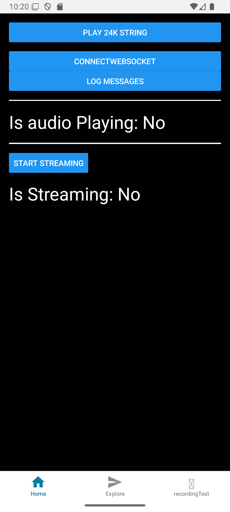

# react-native-gemini-live-audio-project

TouTube: TODO



### How to use:

```bash
git clone https://github.com/OmarThinks/react-native-gemini-live-audio-project
```

Navigate to `express-project`, and create a `.env` file, and put your Gemini API key like this:

```bash
GOOGLE_API_KEY=""
```

Then run the backend like this:

```bash
cd express-project
npm start
```

And in another terminal tab, run the React Native project:

```bash
cd react-native-app
npm i
npm run android
```

In this file:

react-native-app/app/(tabs)/index.tsx

Change the local ip address to match your local ip address (Because React native can't access localhost).
